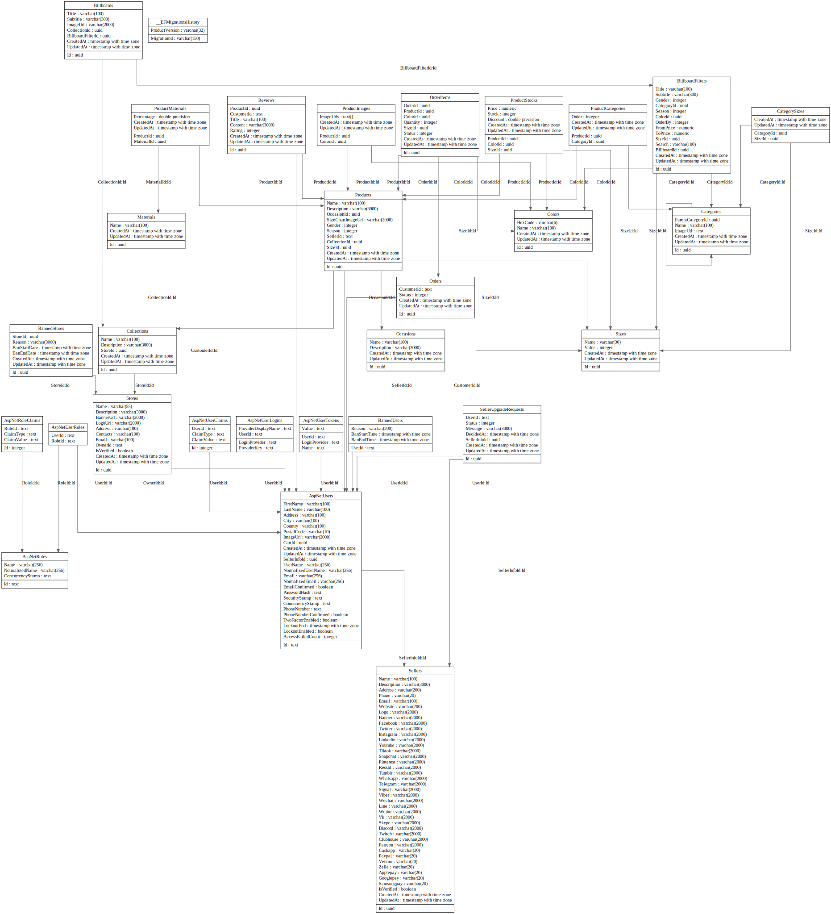

# EasyCommerce-API 🛍️
A robust and scalable ecommerce platform built with ASP.NET Web API.

## 📖 Introduction

**EasyCommerce-API** is an back-end for ecommerce platform that provides a space for sellers to list their clothing and shoe products. It offers a user-friendly interface and a robust set of features to facilitate online commerce. The platform is built with ASP.NET Web API, ensuring a high level of performance and scalability.

## Table of Contents 📑
- [Introduction](#-introduction)
- [Project Structure](#-project-structure)
- [Installation](#-installation)
- [Usage](#-usage)
- [Contributing](#-contributing)
- [License](#-license)
- [Features](#-features)
- [API Endpoints](#-api-endpoints)
- [Database Schema](#-database-schema)
- [Authentication and Authorization](#-authentication-and-authorization)
- [Error Handling](#-error-handling)
- [Testing](#-testing)


## 🏗️ Project Structure
<details>
<summary>Click to expand</summary>

The project has the following structure:

- **Root Directory**
    - **Dependencies**: Contains third-party libraries and NuGet packages used by the project.
    - **Properties**: Stores configuration files for the project.
    - **Config**: Holds additional configuration files specific to the application's logic.
    - **Controllers**: Contains the C# classes responsible for handling API requests and responses.
    - **Data**: Houses the data access layer of the application.
    - **Hubs**: Contains SignalR hubs if the application uses real-time communication features.
    - **Middleware**: Holds custom middleware components that intercept and process HTTP requests before they reach the controllers.
    - **Models**: Stores the C# classes representing the data models used by the application.
    - **RequestHelpers**: Contains helper classes for processing and validating API request data.
    - **Services**: Holds the application's core business logic, implemented as reusable services.
    - **.env.dev**: Stores environment variables specific to the development environment.
    - **appsettings.json**: Contains the main application configuration settings.
    - **appsettings.Development.json**: Overrides or augments appsettings.json with development-specific settings.
    - **Dockerfile**: Specifies the instructions for building a Docker image for the application.
    - **Program.cs**: The main entry point of the application.

- **Subdirectory (C# Lib)**
    - **Dependencies**: Holds external libraries for this sub-project.
    - **Env.cs**: Defines environment variables specific to this sub-project.

</details>

## ⚙️ Installation
<details>
<summary>Click to expand</summary>

To install and run the project, you have two options:
1. **Using Docker Compose**
```bash
docker-compose up --build
```
This will build the Docker images and start the services, including the PostgreSQL container.

2. **Locally without Docker**
Before building the project, you might want to run
```bash
dotnet restore
dotnet run
```
Change the `DB_CONNECTION_STRING` in the `appsettings.Development.json` file to point to your local PostgreSQL database.

</details>

## 🚀 Usage
<details>
<summary>Click to expand</summary>

To use the EasyCommerce-API, follow these steps:

1. **Start the Application**: If you're using Docker, run `docker-compose up --build` in the terminal from the root directory of the project. If you're running the project locally, use `dotnet run` from the terminal or start the project from your IDE.

2. **Access the API**: The API will be accessible at `http://localhost:5000`. You can use tools like Postman or curl to send HTTP requests to the API.

3. **API Endpoints**: Refer to the [API Endpoints](#-api-endpoints) section for details on the available endpoints and their functionality.

4. **Authentication**: Some endpoints may require authentication. Refer to the [Authentication and Authorization](#-authentication-and-authorization) section for details on how to authenticate.

Remember to replace the `DB_CONNECTION_STRING` in the `appsettings.Development.json` file with your local PostgreSQL database connection string if you're running the project locally.

</details>

## 📄 License
<details>
<summary>Click to expand</summary>

Information about the project's license.

</details>

## 💡 Features
<details>
<summary>Click to expand</summary>

The EasyCommerce-API provides a wide range of features to facilitate online commerce. Here are the main features:

- 🚀 **User Management**: Admins can manage users, including banning/unbanning users, handling user upgrade requests, and changing user roles.

- 🔒 **Authentication**: Users can register, login, change their email or password, and refresh their tokens. The API also provides a way to validate tokens.

- 🏷️ **Category Management**: Users can create, read, update, and delete product categories.

- 🎨 **Collection and Billboard Management**: Users can manage collections and their associated billboards.

- 🛒 **Cart and Order Management**: Customers can manage their shopping cart, confirm their cart to place an order, and view their orders.

- ⭐ **Product Reviews**: Customers can review products.

- 🧾 **Seller Management**: Sellers can view their orders.

- 🏪 **Store Management**: Sellers can manage their stores.

- 📦 **Product Management**: Users can create, read, update, and delete products.

- 📊 **Product Stock Management**: Each product, specific to color and size, has a separate quantity. This allows for detailed stock management and availability tracking.

- 🖼️ **Image Management**: Each product color can have its own set of images. This allows customers to see the product in different colors and from various angles, enhancing the shopping experience.

</details>

## 🌐 API Endpoints
<details>
<summary>Click to expand</summary>

Here is a brief description of each API endpoint:
- `/api/admin/users`: GET request to retrieve all users.
- `/api/admin/users/banned`: GET request to retrieve all banned users.
- `/api/admin/users/upgrade-requests`: GET request to retrieve all user upgrade requests.
- `/api/admin/users/upgrade-requests/{id}`: GET request to retrieve a specific user upgrade request. POST request to approve a user upgrade request.
- `/api/admin/users/{id}`: GET request to retrieve a specific user. PUT request to update a specific user. DELETE request to delete a specific user.
- `/api/admin/users/{id}/ban`: POST request to ban a specific user.
- `/api/admin/users/{id}/role`: PUT request to change the role of a specific user.
- `/api/admin/users/{id}/unban`: POST request to unban a specific user.
- `/api/auth/change-email`: POST request to change the email of the authenticated user.
- `/api/auth/change-password`: POST request to change the password of the authenticated user.
- `/api/auth/login`: POST request to login a user.
- `/api/auth/me`: GET request to retrieve the authenticated user.
- `/api/auth/refresh-token`: POST request to refresh the authentication token.
- `/api/auth/register`: POST request to register a new user.
- `/api/auth/validate-token`: POST request to validate an authentication token.
- `/api/categories`: GET request to retrieve all categories. POST request to create a new category.
- `/api/categories/{id}`: GET request to retrieve a specific category. PUT request to update a specific category. DELETE request to delete a specific category.
- `/api/collections`: GET request to retrieve all collections. POST request to create a new collection.
- `/api/collections/{collectionId}/billboards`: GET request to retrieve all billboards of a specific collection. POST request to create a new billboard in a specific collection.
- `/api/collections/{collectionId}/billboards/{billboardId}`: GET request to retrieve a specific billboard of a specific collection. PUT request to update a specific billboard of a specific collection. DELETE request to delete a specific billboard of a specific collection.
- `/api/collections/{id}`: GET request to retrieve a specific collection. PUT request to update a specific collection. DELETE request to delete a specific collection.
- `/api/customer/cart`: GET request to retrieve the cart of the authenticated customer. POST request to add a product to the cart of the authenticated customer. PUT request to update the cart of the authenticated customer.
- `/api/customer/cart/confirm`: POST request to confirm the cart of the authenticated customer and place an order.
- `/api/customer/cart/{cartProductId}`: GET request to retrieve a specific product in the cart of the authenticated customer. DELETE request to remove a specific product from the cart of the authenticated customer.
- `/api/customer/orders`: GET request to retrieve all orders of the authenticated customer.
- `/api/customer/reviews`: POST request to create a new review by the authenticated customer.
- `/api/customer/upgrade`: POST request to request an upgrade for the authenticated customer.
- `/api/products`: GET request to retrieve all products. POST request to create a new product.
- `/api/products/{id}`: GET request to retrieve a specific product. PUT request to update a specific product. DELETE request to delete a specific product.
- `/api/products/{productId}/reviews`: GET request to retrieve all reviews of a specific product.
- `/api/products/{productId}/reviews/{reviewId}`: DELETE request to delete a specific review of a specific product.
- `/api/seller`: GET request to retrieve the authenticated seller.
- `/api/seller/orders`: GET request to retrieve all orders of the authenticated seller.
- `/api/seller/orders/{orderId}`: GET request to retrieve a specific order of the authenticated seller.
- `/api/stores`: GET request to retrieve all stores. POST request to create a new store.
- `/api/stores/my`: GET request to retrieve the store of the authenticated seller.
- `/api/stores/{id}`: GET request to retrieve a specific store. PUT request to update a specific store. DELETE request to delete a specific store.

Detailed controllers documentation can be found [here](docs/controllers.md)
</details>

## 💾 Database Schema
<details>
<summary>Click to expand</summary>

You can find the database schema for the project as svg file at the following path: `docs/images/DBStructure.svg`

Preview:


</details>

Details of the database schema can be found [here](docs/database-schema.md)

## 🔒 Authentication and Authorization
<details>
<summary>Click to expand</summary>

Description of how authentication and authorization is handled in the project.

</details>

## ⚠️ Error Handling
<details>
<summary>Click to expand</summary>

Description of how errors are handled in the project.

</details>

## 🧪 Testing
<details>
<summary>Click to expand</summary>

Description of how testing is done in the project.

</details>